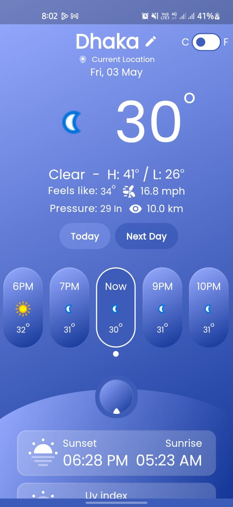
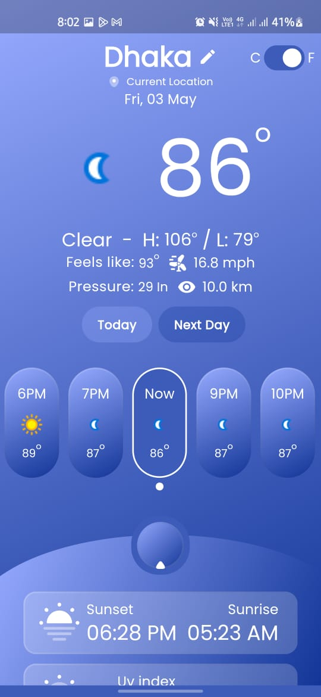
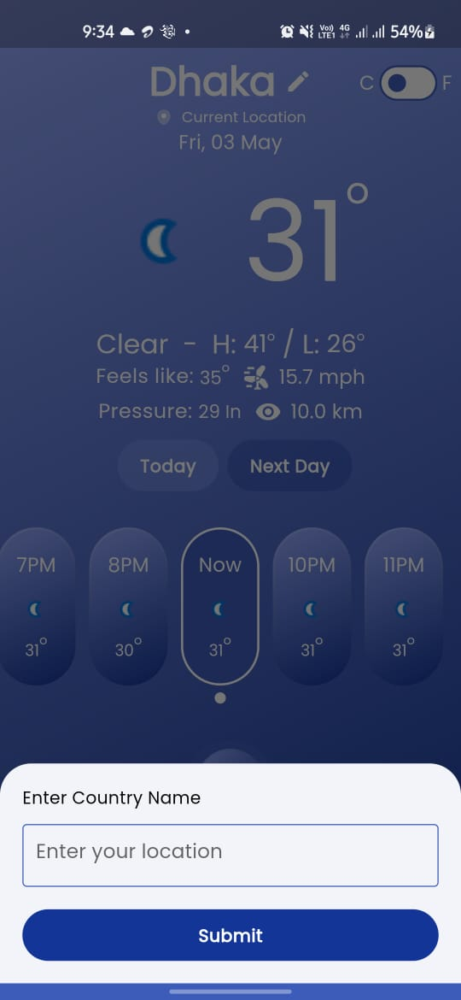

# Weather App



## Description

The Weather App is a simple and intuitive application designed to provide users with accurate weather information based on their current location. It offers a visually appealing interface and a range of features to keep users informed about the weather conditions.

## Features

- **Current Weather**: Display the current temperature, weather description, wind speed, humidity, and other relevant information.
- **3-Day Forecast**: View the weather forecast for the next 3 days, including the date, weather icon, and temperature.
- **Location Services**: Automatically determine the user's location (latitude and longitude) to fetch weather data specific to their location.
- **Manual Location Entry**: Provide an option for users to manually enter a location if they prefer.
- **Unit Conversion**: Implement unit conversion between Celsius and Fahrenheit for temperature.
- **Additional Weather Details**: Include additional weather details such as pressure, visibility, etc.

## Screenshots




## Technologies Used

- Flutter: Cross-platform framework for building mobile applications.
- Riverpod: State management library for Flutter applications.

## Installation

1. Clone the repository:

```bash
git clone https://github.com/faysalewucse/weather-app.git

2. Step 2

```
flutter pub get

## Download the app
(https://drive.google.com/uc?export=download&id=1WxVT23_p8esB9Bau9au-8tlFAbr9bQTf/view?usp=sharing)
